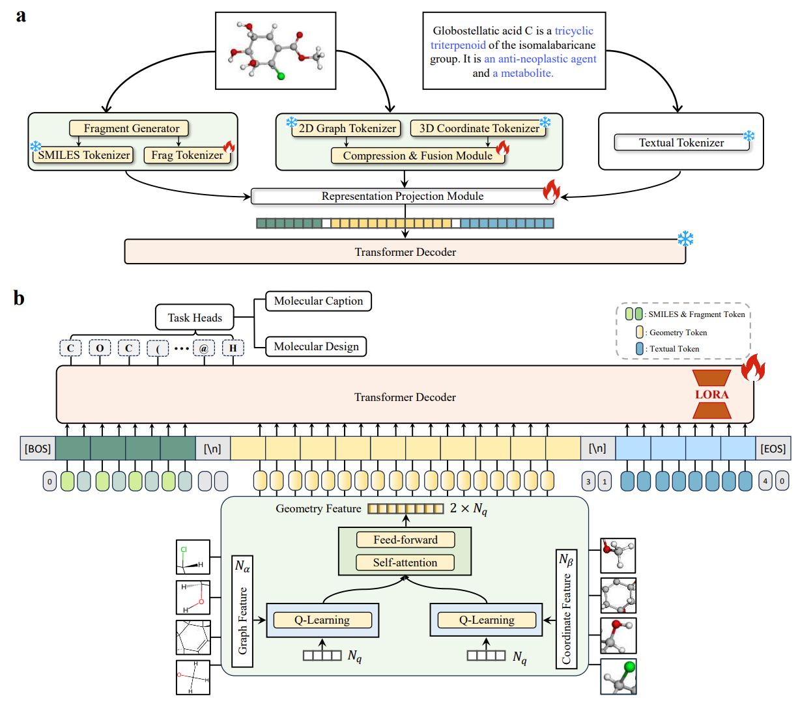
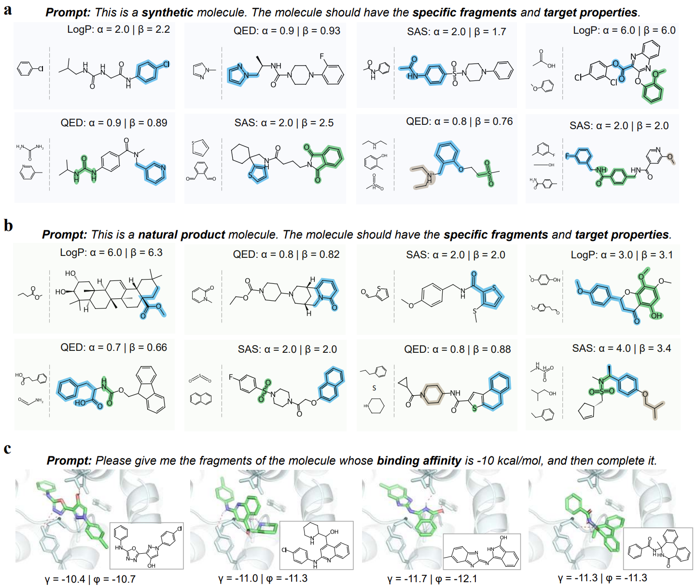
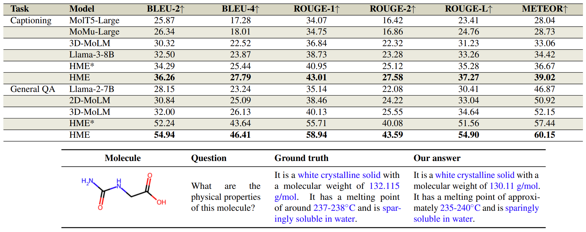
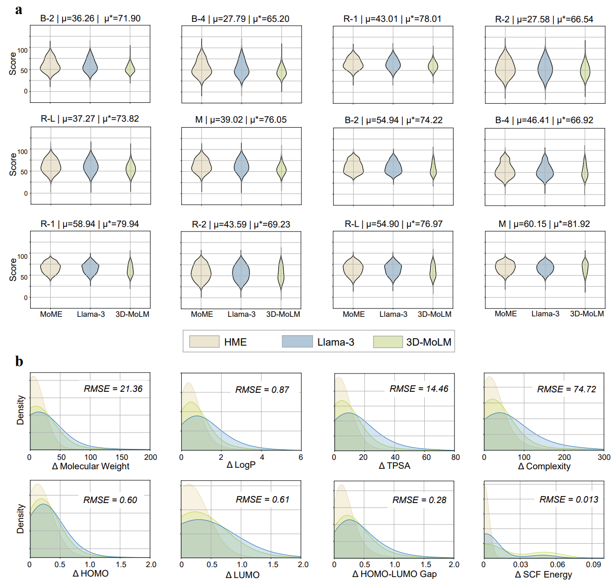

<h2 align="center"> <a href="https://arxiv.org/abs/2412.20888">Navigating Chemical-Linguistic Sharing Space with Heterogeneous Molecular Encoding</a></h2>
<h5 align="center">
    
[](https://arxiv.org/abs/2412.20888)
[](https://huggingface.co/collections/GreatCaptainNemo/hme-checkpoints-6772a4b9d3a8d679c97f3bc3)
[](https://huggingface.co/datasets/GreatCaptainNemo/HME_dataset)
<!-- [](https://github.com/Lyu6PosHao/ProLLaMA/blob/main/LICENSE) --> <br>

</h5>

## A. Update Log
* [2024/12/31] Opensource the whole datasets, some model checkpoints and codes.


## B. Glance
Recent advances in **Chemical Language Models (CLMs)** have shown great promise in bridging molecular structures and natural language for drug discovery and molecular comprehension. However, current approaches face significant challenges due to inherent biases in different molecular representations, limiting their effectiveness in capturing **comprehensive molecular information** and achieving **reliable molecular design**. Building upon recent developments in Large Language Models (LLMs), we propose a **Heterogeneous Molecular Encoding (HME) framework** that aims to improve **the bidirectional mapping within the chemical-linguistic sharing space**.

<p align="center"></p>


</p ></details>

## C. Highlights
### 1. Framework suitable for advanced LLMs
We propose Heterogeneous Molecular Encoding (HME), **a streamlined framework suitable for LLMs that integrates sequential and geometric molecular features to achieve unbiased encoding**.
### 2. A dataset for multi-conditional molecular design
We propose the MCMoD dataset, a comprehensive dataset containing **more than 1 million molecules** with their corresponding **textual descriptions, molecular fragments, and chemical property control signals**.

### 3. Excellent performance
**Navigating linguisitic space:** HME achieves substantial performance in molecular captioning and question-answering. **Navigating chemical space:** HME demonstrates \textbf{reliable molecular design capabilities under various control signals}. Notably, **in zero-shot scenarios**, our framework achieves a remarkable 79.4\% success rate.

## D. Main Results
* **Navigating chemical space with linguistic guidance:**
  
  including: description-based molecular generation (**Chain of Thought** used), multi-objective molecular reverse design (**fragment serves as one of conditions**)
  <p align="center"></p>
  <p align="center"></p>

* **Navigating linguisitic space with molecular guidance:**
    
    including: molecular captioning, molecular general QA, molecular property QA, etc.
  <p align="center"></p>
  <p align="center"></p>
  
  
* More results can be found in the paper.

## E. Src File Stucture
- datasets/: store the datasets we used to train and test HME
- fragment_vocabs/: fragment vocabulary files
- metrics/: python files to evaluate the experimental results
- molecular_towers/: frozen molecular 2D encoders and 3D encoders
- psvae/: the principle subgraph mining algorithm to transform SMILES into fragments.
- scripts/: bash scripts to run the models.
- configuration_llava.py: the config of the HME model.
- data.py: to define the dataset class.
- frg.py: to fragment molecules.
- infer.py: model inference.
- modeling_llava.py: the architecture of the HME model.
- preprocess.py: preprocess the json files of our datasets. 
- utils.py: some utils including loading models, initializing models, setting random seeds, etc.

## F. Install Requirements
```
conda create -n hme python=3.10
pip install -r requirements.txt
#only some key packages are listed in the requirements.txt.
#If bugs occur during run our codes, please let us know and we will handle it promptly.
```


## G. Dataset Preparation
All the data used in our paper can be found in [HuggingFace](https://huggingface.co/datasets/GreatCaptainNemo/HME_dataset), where a detailed description is also provided. To reproduce HME:
1. Download the dataset from [HuggingFace](https://huggingface.co/datasets/GreatCaptainNemo/HME_dataset) and put it under src/datasets/
2. Preprocess the dataset:
    ```
    python preprocess.py
    ```
    The purpose of this step is to use frozen 2D encoder and 3D encoder to obtain the 2D and 3D features of the molecule. You need to modify the file path in preprocess.py to the actual json file path.

## H. Quick Inference
1. Download our HME checkpoint from [HuggingFace](https://huggingface.co/collections/GreatCaptainNemo/hme-checkpoints-6772a4b9d3a8d679c97f3bc3).
2. Model inference:
    ```
    sh ./scripts/eval.sh
    ```
3. use ./metrics/*.py to evaluate the generated results.
    - mol2text_metrics.py: for captioning, general qa
    - number_metrics.py: for property qa
    - text2mol_metrics.py: for description-based molecular generation


## I. Acknowledgements
We would like to express our gratitude to the related projects and research and development personnel:

Codes: [Huggingface LLaVa](https://huggingface.co/docs/transformers/v4.47.1/en/model_doc/llava), [PS-VAE](https://github.com/THUNLP-MT/PS-VAE)

Data: [3D-MoIT](https://huggingface.co/datasets/Sihangli/3D-MoIT), [Tartarus](https://github.com/aspuru-guzik-group/Tartarus), [PubChem](https://pubchem.ncbi.nlm.nih.gov/docs/downloads), [PubChemQC](https://nakatamaho.riken.jp/pubchemqc.riken.jp/), [ChEBI](https://www.ebi.ac.uk/chebi/), [DTP](https://dtp.cancer.gov/), [ZINC](https://zinc.docking.org/)

Others: [Meta-llama](https://huggingface.co/meta-llama), [GraphFP](https://github.com/lvkd84/GraphFP), [Uni-Mol](https://github.com/deepmodeling/Uni-Mol), [MoleculeSTM](https://github.com/chao1224/MoleculeSTM)

## J. Citation
If you find our repo helpful, please consider citing us.
```BibTex
@misc{lv2024navigatingchemicallinguisticsharingspace,
      title={Navigating Chemical-Linguistic Sharing Space with Heterogeneous Molecular Encoding}, 
      author={Liuzhenghao Lv and Hao Li and Yu Wang and Zhiyuan Yan and Zijun Chen and Zongying Lin and Li Yuan and Yonghong Tian},
      year={2024},
      eprint={2412.20888},
      archivePrefix={arXiv},
      primaryClass={cs.CE},
      url={https://arxiv.org/abs/2412.20888}, 
}
```